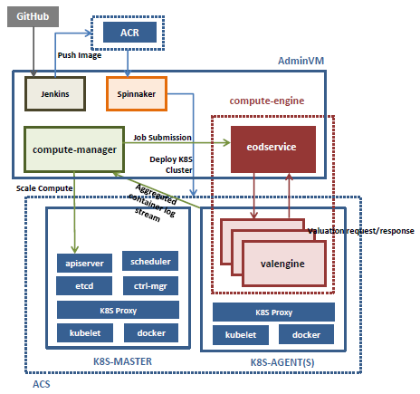

# compute-engine-rpc

A simple client-server version of the [mock compute engine](https://github.com/amolthacker/cloud-poc) application written in Go. 
`eodservice` simulates the client that submits valuation requests to a grid of remote compute engine (server) instances 
`valengine`. The application uses the [Kite](https://github.com/koding/kite) micro-services framework for RPC. 
The `valengine` responds to requests by doing static pricing compute using the [mockvalengine](https://github.com/amolthacker/azure-poc-compute-engine-mock)

It comprises of the following two components:

 * [compute-engine](https://github.com/amolthacker/azure-poc-compute-engine-acs-rpc-ce)
   
 * [compute-manager](https://github.com/amolthacker/azure-poc-compute-engine-acs-rpc-cm)
 

### Architecture

Docker containerized compute-engine instances running in a Kubernetes orchestrated cluster in Azure Container Service as shown below.




### Provisioning

 ```
 see scripts/vtasaz-provision.sh
 ```


### CI/CD Workflow


### Operations

One can:

 * Scale the no.of engine instances (upto 10) using the slider
 
 * Submit jobs for different metrics
 
 * View aggregated container log stream 


Note: 

 * Currently, job submissions are load balanced across engine instances in batch sizes of 100. In order to better 
   distribute load across engines, one should make multiple job submissions in tandem
    ```
    N trades for metric X
    M trades for metric Y
    ...
    ```
    TODO: A coordinator/router for more nuanced scheduling so as to distribute trade valuation requests across engine 
    instances per job submission
 
 * The engine instances will autoscale up/down (min 2) on change in CPU load simulated through multiple job 
   submissions/completions
    
 * Currently, on autoscale (up), the running jobs do not re-balance to newly provisioned engines but the job submissions
   post autoscale will be able to use newly provisioned engines


This is a basic demo app put together to explore Azure, ACS/Kubernetes and Spinnaker based on available quick start 
templates and to drive the concepts and value-add of cloud enabled infrastructure provisioning, elasticity of compute, 
continuous delivery etc for non-technical executive level audience
